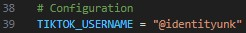
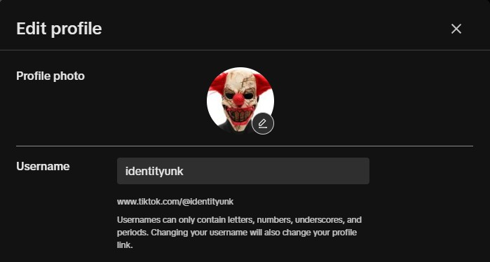
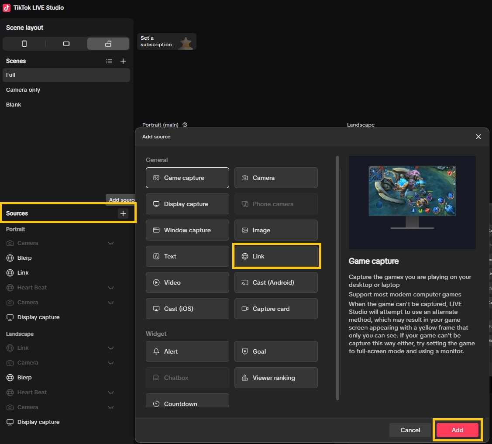

# TikTok Overlay

Adds an overlay to a TikTok live stream to enhance interaction and engagement.

## Table of Contents
- [Features](#features)
- [Installation](#installation)
- [Usage](#usage)

## Features

- Displays random GIFs with sound when a user follows or subscribes
- Sets a default TTS voice for all users, which plays randomly with a 15-second cooldown (applies to all)
  - Sets a TTS voice for subs only
  - Sets individual TTS voice
- Allows for chat commands to fire off events
- Play sounds for specific events, like donations
- TSS announces the game name when the user asks

## Installation

Clone repo. <br>
Open a terminal to the file location you want to install the project.
```bash
git clone https://github.com/jcmalott/tiktok_stream.git
cd tiktok_stream
npm install
```

## Usage

Steps for running the server and client-side application.

Starting from the root folder.<br>
```bash
cd frontend
npm start
```

Starting from the root folder.<br>
```bash
cd backend
py flasktest.py
```
NOTE: 
To change TikTok livestream user, within flasktest.py<br>
  Change the username to your account username.<br>
  
  

If you run this before the user is live, you will need to restart it.

Add a link to TikTok Studio.
http://localhost.com:3000/



